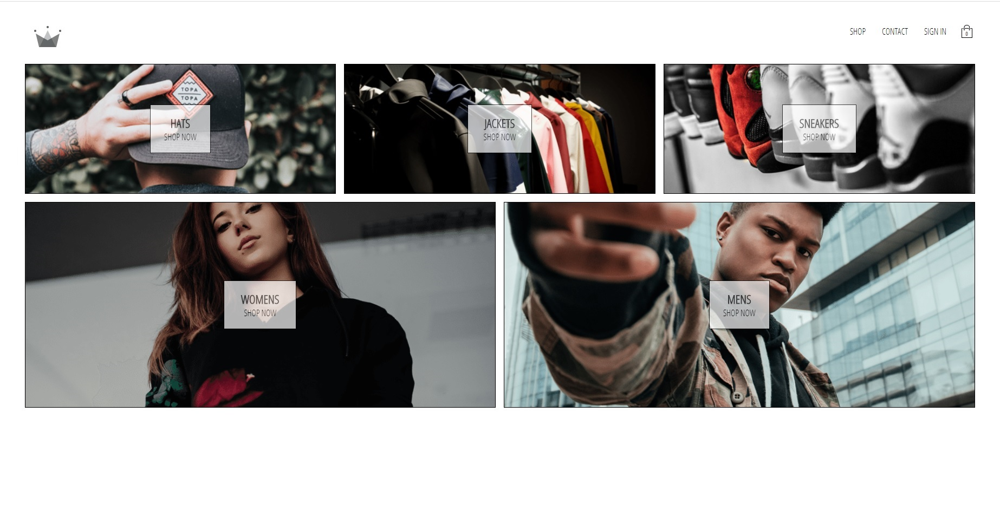
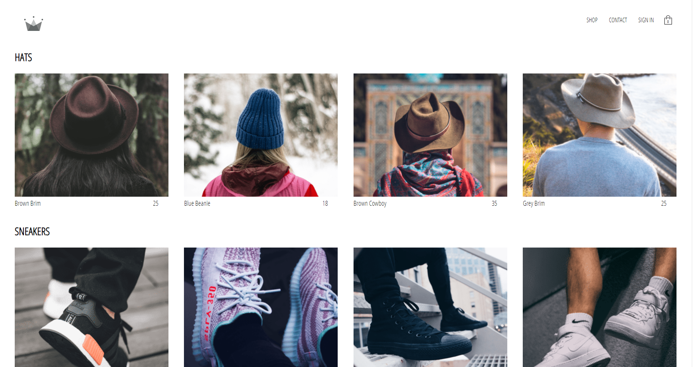
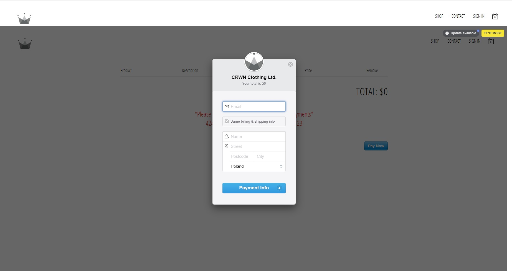

# Crwn-clothing is an e-commerce website built with React-Redux. 

Try the Live Demo - https://crwn-live-002.herokuapp.com/

# Features :fire:

- [x] Browse Categories
- [x] Login using Google and Email
- [x] Cart
- [ ] Demo payement using [Stripe](https://stripe.com)

# Libraries :closed_book:

* [React](https://reactjs.org/)
* [Redux](https://redux.js.org/)
* [Reselect](https://github.com/reduxjs/reselect)
* [Redux Persist](https://github.com/rt2zz/redux-persist)
* [React-Router](https://reacttraining.com/react-router/web/guides/quick-start)
* [Firebase](https://firebase.google.com/)

# Screenshots :camera:

### Shopping Menu :moneybag:

### Payment Menu :lock:

